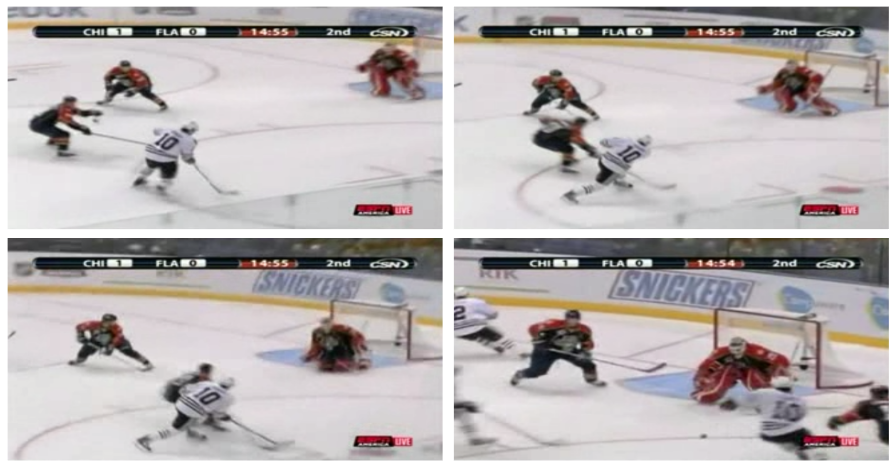
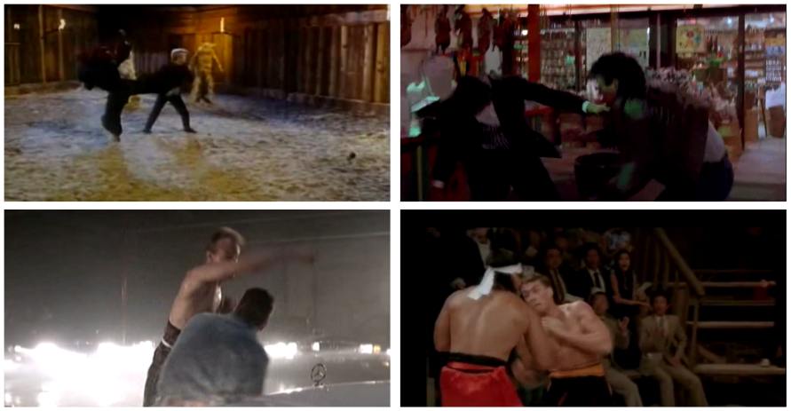
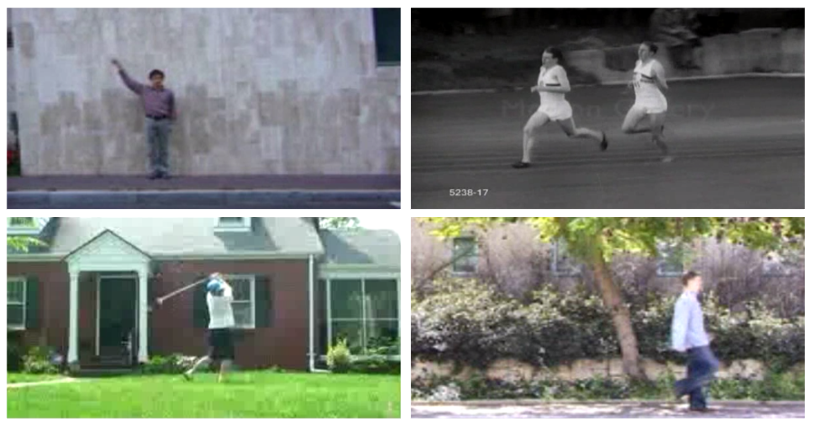
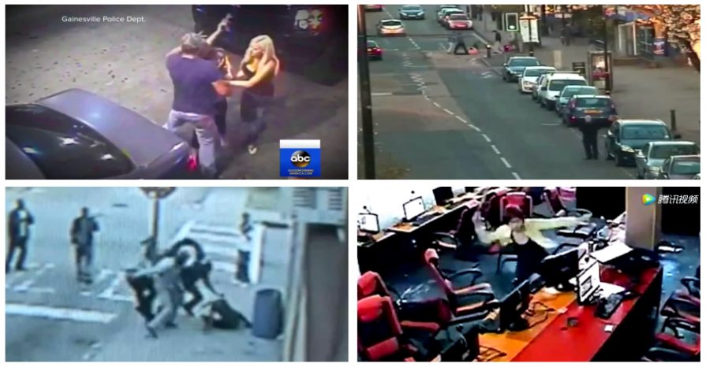
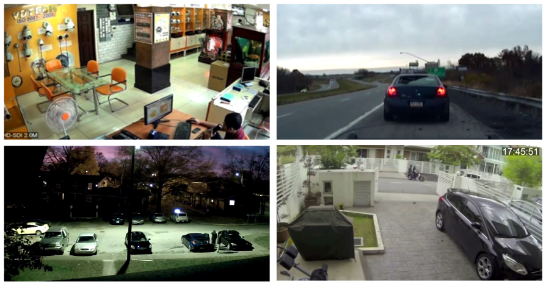

# **Violence Detection in Videos with Transformers**

En este trabajo se propone analizar, experimentar y evaluar dos adaptaciones de arquitecturas *Transformer* para la detección de violencia en videos:

* DeVTr [1]
* ViViT [2] [6]

## **Conjuntos de Datos**

* [*Hockey Fight*](https://drive.google.com/drive/folders/15BC-cyDnRoZ6PILk1_JO4tiqbP90S_zU?usp=share_link): *Hockey Fight* fue presentado por Bermejo Nievas et al. [3] en el año 2011. Este conjunto de datos es uno de los más usados en la investigación de detección de violencia en videos. *Hockey Fight* tiene un total de 1000 clips de video de partidos de hockey de la Liga Nacional de Hockey (National Hockey League - NHL). Cada clip tiene una duración de 2 segundos y una tasa de frames por segundo de 25. Los videos tienen una resolución de 360x288 píxeles. De los 1000 videos, 500 están etiquetados como "Violencia" y los otros 500 como "No Violencia". Los videos no contienen audio y están disponibles en formato AVI. En la Figura 1 se muestran algunos frames de un video del conjunto de datos *Hockey Fight* perteneciente a la clase "Violencia" y en la Figura 2 de la clase "No Violencia".

    

*Figura 1: Frames de un video perteneciente a la clase "Violencia" tomados del conjunto de datos Hockey Fight [3].*

    

*Figura 2: Frames de un video perteneciente a la clase "No Violencia" tomados del conjunto de datos Hockey Fight [3].*

* [*Violence in Movies*](https://drive.google.com/drive/folders/1JZtTutsU-1eXAeWt8M5T9v596FJ6eKHJ?usp=share_link): El conjunto de datos *Violence in Movies* consta de videos obtenidos de películas que contienen escenas de peleas y de acción. Fue presentado por Bermejo Nievas et al. [3] junto con el conjunto de datos *Hockey Fight*. La cantidad de clips de video que contiene es de 200, número significativamente menor en comparación con otros conjuntos de datos. De los 200 videos, 100 están etiquetados como "Violencia" y los otros 100 como "No Violencia". Al igual que el conjunto de datos *Hockey Fight*, los clips de video tienen una duración de 2 segundos y la tasa de frames por segundo es de 25. En la Figura 3 se muestran algunos frames de varios videos del conjunto de datos *Violence in Movies* pertenecientes a la clase "Violencia" y en la Figura 4 de la clase "No Violencia". Mientras que el conjunto de datos *Hockey Fight* es uniforme en términos de formato y contenido, el conjunto de datos *Violence in Movies* presenta una mayor variedad de escenas capturadas en diferentes resoluciones. Además, este último tiene videos en diferentes formatos de archivo. Cabe resaltar que los clips de video correspondientes a la clase "No Violencia" fueron tomados de varios conjuntos de datos para la tarea del reconocimiento de acciones [5].

    

*Figura 3: Frames de varios videos pertenecientes a la clase "Violencia" tomados del conjunto de datos Violence in Movies [3].*

    

*Figura 4: Frames de varios videos pertenecientes a la clase "No Violencia" tomados del conjunto de datos Violence in Movies [3].*

* *RWF-2000* [4]: Este conjunto de datos fue propuesto por Cheng et al. [4] en el año 2021. El número total de clips de video es de 2000. Estos videos fueron captados por cámaras de vigilancia en ambientes del mundo real y fueron colectados de la página web de YouTube. Los videos poseen diferentes resoluciones y una duración de 5 segundos cada uno. La tasa de frames por segundo es de 30. En la Figura 5 se muestran algunos frames de varios videos del conjunto de datos RWF-2000 pertenecientes a la clase "Violencia" y en la Figura 6 de la clase "No Violencia".

    

*Figura 5: Frames de varios videos pertenecientes a la clase "Violencia" tomados del conjunto de datos RWF-2000 [4].*

    

*Figura 6: Frames de varios videos pertenecientes a la clase "No Violencia" tomados del conjunto de datos RWF-2000 [4].*

## **Métricas**

Se evaluará el rendimiento de las adaptaciones propuestas en términos de tres métricas: *accuracy*, *precision* y *recall*.

$accuracy = \frac{Positivos Verdaderos + Negativos Verdaderos}{Positivos Verdaderos + Negativos Verdaderos + Falsos Positivos + Falsos Negativos}$

$precision = \frac{Positivos Verdaderos}{Positivos Verdaderos + Falsos Positivos}$

$recall = \frac{Positivos Verdaderos}{Positivos Verdaderos + Falsos Negativos}$

## **Referencias**

[1] Abdali, A. R. (2021, July). Data efficient video transformer for violence detection. In 2021 IEEE International Conference on Communication, Networks and Satellite (COMNETSAT) (pp. 195-199). IEEE.

[2] Arnab, A., Dehghani, M., Heigold, G., Sun, C., Lučić, M., & Schmid, C. (2021). Vivit: A video vision transformer. In Proceedings of the IEEE/CVF international conference on computer vision (pp. 6836-6846).

[3] Bermejo Nievas, E., Deniz Suarez, O., Bueno García, G., & Sukthankar, R. (2011). Violence detection in video using computer vision techniques. In Computer Analysis of Images and Patterns: 14th International Conference, CAIP 2011, Seville, Spain, August 29-31, 2011, Proceedings, Part II 14 (pp. 332-339). Springer Berlin Heidelberg.

[4] Cheng, M., Cai, K., & Li, M. (2021, January). RWF-2000: an open large scale video database for violence detection. In 2020 25th International Conference on Pattern Recognition (ICPR) (pp. 4183-4190). IEEE.

[5] Serrano Gracia, I., Deniz Suarez, O., Bueno Garcia, G., & Kim, T. K. (2015). Fast fight detection. PloS one, 10(4), e0120448.

[6] Singh, S., Dewangan, S., Krishna, G. S., Tyagi, V., & Reddy, S. (2022). Video Vision Transformers for Violence Detection. arXiv preprint arXiv:2209.03561.
